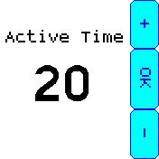
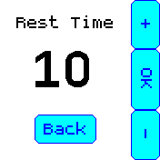
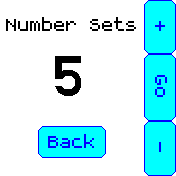
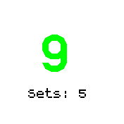
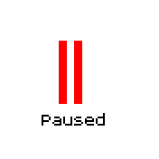
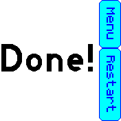

# Interval Timer

An interval timer for workouts and whatever else!

## Usage

First set the active time (i.e. the number of seconds to perform exercises).

Next set the rest time (i.e. number of seconds to rest between exercises).

Finally choose the number of sets to perform.

Active time will be shown in red, rest time in green. The watch will buzz whenever active or rest time gets to 0.

You can press the physical button during timer countdown to pause the timer.

View after all sets are completed. Press menu to change settings or restart to start timer again with the same settings.

## Creator

James Gough
