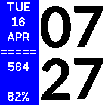
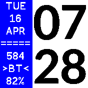

# jclock

I have used Rebble clock since I bought my Banglejs 2, and wanted to make my own clock with much simpler features and to switch the time window and the feature window because I'm wearing my watch on my left wrist and about a half (left side) of the screen is covered by the sleeve of my jacket or shirts. Of course it won't happen during summer, but I decided to make my first Bagle app with these changes. See Features below for the items displayed on the screen.
- The layout is inspired by the Rebble clock.
- The big font KdamThmor is copied from the Rebble clock.

## Features
- Single screen
- No settings
- Time on the right side with big font
- On the sidebar on the left
  - Day of week
  - Day
  - Month
  - Steps
  - Bluetooth connection status
  - Battery %
- Update time and status every 1 minute

## Screenshots

## Creator

Written by [JeonLab](https://jeonlab.wordpress.com)
