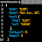
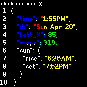
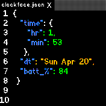
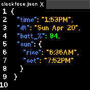
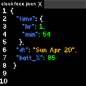
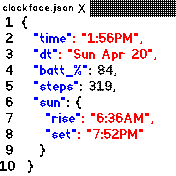
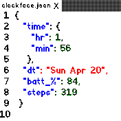
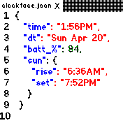
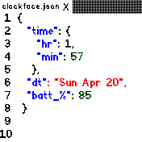

# JSON Clock 

  *JSON view of the time.*

Written by: [David Volovskiy](https://github.com/voloved) and fully
inspired by  [This FitBit face](https://github.com/Sharkgrammer/clockface.json)

* Displays a JSON that shows the date, time, step count, sunrise/set and battery.
* If the Bangle's theme is dark, then it'll show in dark view (`Settings>System>Theme>Dark BW`)
* It'll show 12 hrs if it's set so in `Settings>System>Locale>Time Format`
* Along with the physical button, you can leave the clock by pressing the `X` next to the `clockface.json` in the tab.
* If the steps cannot be gotten, they won't display
* If the location isn't set, then the JSON array will ignore the sun info and instead display the time as a struct.

## Screenshots

