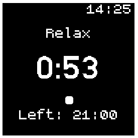

# Japanese Walking Timer

A simple timer designed to help you manage your walking intervals, whether you're in a relaxed mode or an intense workout!

## Usage

- The timer starts with a default total duration and interval duration, which can be adjusted in the settings.
- Tap the screen to pause or resume the timer.
- The timer will switch modes between "Relax" and "Intense" at the end of each interval.
- The display shows the current time, the remaining interval time, and the total time left.

## Creator

[Fabian Köll] ([Koell](https://github.com/Koell))

## Icon

[Icon](https://www.koreanwikiproject.com/wiki/images/2/2f/%E8%A1%8C.png)