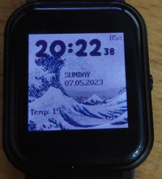

# Kanagawa clock

This clock displays the great wave of kanagawa in the background.

It also displays:
- Hours, minutes and seconds.
- Seconds are only displayed when screen is unlocked.
- Years, monts and day as in numbers.
- Name representation of the current day.
- Current temperature from weather, if available.
- Battery level in percent.

