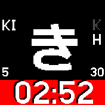
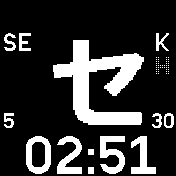

# kanawatch

A simple watchface design perfect for learning hiragana and katakana.

* Interact with the interface using swipes
* Swipe up/down to switch between hiragana (H) and katakana (K)
* Swipe right/left to display the next or previous letter
* Tap to change accent color (always 24h, not configurable)
* Non-intrustive transition animations
* Low battery consumption

## TODO

* Only render what needs to be repainted
* Dont redraw the widgets if not necessary
* Minigame to guess kata/hira phonem

## Author

Written by pancake in 2022, maintained during 2023 and powered by insomnia

## Screenshots

