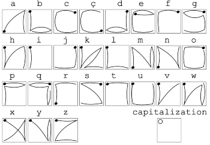

# EdgeWrite Keyboard

A library that provides a swipeable keyboard using the EdgeWrite system https://depts.washington.edu/ewrite/

## Usage

Swipe from corner to corner to enter characters, then press the button to submit the text to the calling app. To capitalize letters, complete your stroke in the top left corner.

To display the in app character chart, long press the screen; you can scroll through it by swiping. A dot represents the starting position of the swipe. Press the button to go back.

For a full character chart see [EwChart.pdf](EwChart.pdf)

**Supported:** Letters (including capitals), numbers, backspace, word backspace, space, punctuation, new line, accents, extended mode (if characters are supported by the vector font), and some cursor controls (left, right, word left/right, home, end).

**Unsupported:** Word-level stroking.

## Settings

Font size can be selected in Settings app > "Apps" > "EdgeWrite Keyboard"

## Author

Woogal [github](https://github.com/retcurve)
