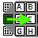

# Matryoshka Keyboard



  

  
 

Nested key input utility.

## How to type

Press your finger down on the letter group that contains the character you would like to type, then tap the letter you
want to enter. Once you are touching the letter you want, release your
finger.


Press "shft" or "caps" to access alternative characters, including upper case letters, punctuation, and special
characters.
Pressing "shft" also reveals a cancel button if you would like to terminate input without saving.

Press "ok" to finish typing and send your text to whatever app called this keyboard.

Press "del" to delete the leftmost character.

## Themes and Colors

This keyboard will attempt to use whatever theme or colorscheme is being used by your Bangle device.

## How to use in a program

This was developed to match the interface implemented for kbtouch, kbswipe, etc.

In your app's metadata, add:

```json
  "dependencies": {"textinput": "type"}
```

From inside your app, call:

```js
const textInput = require("textinput");

textInput.input({text: ""})
         .then(result => {
           console.log("The user entered: ", result);
         });
```

Alternatively, if you want to improve the load time of the keyboard, you can pre-generate the data the keyboard needs
to function and render like so:

```js
const textInput = require("textinput");

const defaultKeyboard      = textInput.generateKeyboard(textInput.defaultCharSet);
const defaultShiftKeyboard = textInput.generateKeyboard(textInput.defaultCharSetShift);
// ...
textInput.input({text: "", keyboardMain: defaultKeyboard, keyboardShift: defaultShiftKeyboard})
         .then(result => {
           console.log("The user entered: ", result);
           // And it was faster!
         });
```

This isn't required, but if you are using a large character set, and the user is interacting with the keyboard a lot,
it can really smooth the experience.

The default keyboard has a full set of alphanumeric characters as well as special characters and buttons in a
pre-defined layout. If your application needs something different, or you want to have a custom layout, you can do so:

```js
const textInput = require("textinput");

const customKeyboard = textInput.generateKeyboard([
  ["1", "2", "3", "4"], ["5", "6", "7", "8"], ["9", "0", ".", "-"], "ok", "del", "cncl"
]);
// ...
textInput.input({text: "", keyboardMain: customKeyboard})
         .then(result => {
           console.log("The user entered: ", result);
           // And they could only enter numbers, periods, and dashes!
         });
```

This will give you a keyboard with six buttons. The first three buttons will open up a 2x2 keyboard. The second three
buttons are special keys for submitting, deleting, and cancelling respectively.

Finally if you are like, super lazy, or have a dynamic set of keys you want to be using at any given time, you can 
generate keysets from strings like so:

```js
const textInput = require("textinput");

const customKeyboard = textInput.generateKeyboard(createCharSet("ABCDEFGHIJKLMNOP", ["ok", "shft", "cncl"]));
const customShiftKeyboard = textInput.generateKeyboard(createCharSet("abcdefghijklmnop", ["ok", "shft", "cncl"]));
// ...
textInput.input({text: "", keyboardMain: customKeyboard, keyboardShift: customShiftKeyboard})
         .then(result => {
           console.log("The user entered: ", result);
           // And the keyboard was automatically generated to include "ABCDEFGHIJKLMNOP" plus an OK button, a shift button, and a cancel button!
         });
```

The promise resolves when the user hits "ok" on the input or if they cancel. If the user cancels, undefined is
returned, although the user can hit "OK" with an empty string as well. If you define a custom character set and
do not include the "ok" button your user will be soft-locked by the keyboard. Fair warning!

At some point I may add swipe-for-space and swipe-for-delete as well as swipe-for-submit and swipe-for-cancel
however I want to have a good strategy for the touch screen
[affordance](https://careerfoundry.com/en/blog/ux-design/affordances-ux-design/).

## Secret features

If you long press a key with characters on it, that will enable "Shift" mode.

