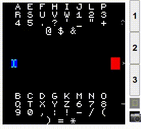

# Morse Keyboard

A library that provides the ability to input text by entering morse code.

## Usage

* Press `BTN1` to input a dot, `BTN3` to input a dash, and `BTN2` to accept the
character for your current input.
* Long-press `BTN1` to toggle UPPERCASE for your next character.
* Long-press `BTN2` to finish editing.
* Tap the left side of the screen for backspace.
* Swipe left/right to move the cursor.
* Input three spaces in a row for a newline.

The top/bottom of the screen show which characters start with your current input,
so basically you just look which side includes the letter you want to type, and 
press that button to narrow your selection, until it appears next to `BTN2`.

## For Developers

See the README for `kbswipe`/`kbtouch` for instructions on how to use this in your app.