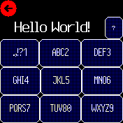
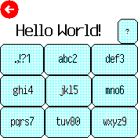
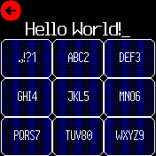

# Multitap Keyboard

A library that provides the ability to input text in a style familiar to anyone who had a mobile phone before they went all touchscreen.

Swipe right for Space, left for Backspace, down for Caps lock switch, and up for cursor moving mode. Swipe left and right to move the cursor in moving mode. Tap the '?' button in the app if you need a reminder!

At time of writing, only the [Noteify app](http://microco.sm/out/Ffe9i) uses a keyboard.

Uses the multitap keypad logic originally from here: http://www.espruino.com/Morse+Code+Texting

Written by: [Sir Indy](https://github.com/sir-indy), [Thyttan](https://github.com/thyttan) and [bobrippling](https://github.com/bobrippling).

For support and discussion please post in the [Bangle JS Forum](http://forum.espruino.com/microcosms/1424/)
