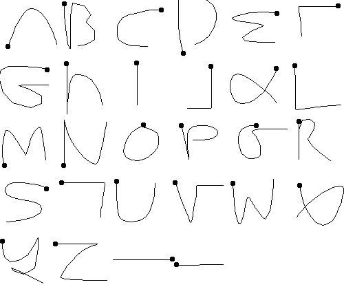

# Swipe Keyboard

A library that provides the ability to input text by swiping PalmOS Graffiti-style characters onto the screen.

To get a legend of available characters, just tap the screen.

To switch between the input of alphabetic, numeric and symbol characters tap the widget which displays either "123", "ABC" or "?:$".

To switch between lowercase and uppercase characters do an up swipe.



## Usage

In your app's metadata, add:

```
  "dependencies": {"textinput":"type"},
```

From inside your app, call:

```
Bangle.loadWidgets();
Bangle.drawWidgets();
require("textinput").input({text:"Foo"}).then(result => {
  console.log("Text input", E.toJS(result));
});
```

The first argument to `input` is an object containing the following:

* `text` - initial text to edit

(in the future, the ability to restrict usage of newline/etc may be added)

## Make your own

You can create your own keyboard input apps. Just ensure that they have
`"type":"textinput",` in their metadata and provide a library called `textinput`
that exports an `input` method.
