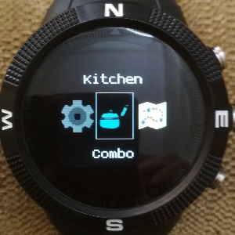
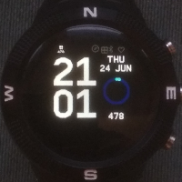
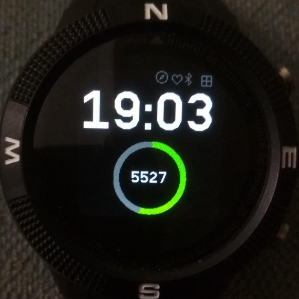
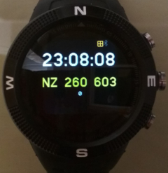
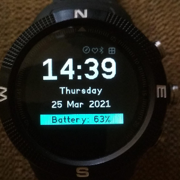
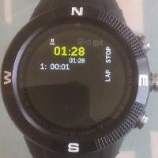
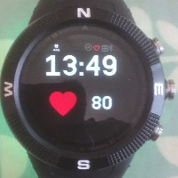
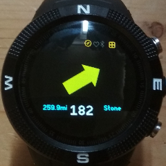
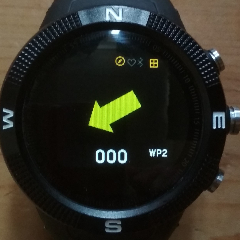
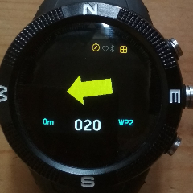

# Kitchen Combo - a multiclock format of the waypointer, walkersclock, stepo, stopwatch, heartrate and arrow apps.



*...everything but the kitchen sink..*

NOTE: This app requires Bangle firmware 2.08.187 or later.  

The app is aimed at navigation whilst walking. Please note that it
would be foolish in the extreme to rely on this as your only
navigation aid!

Please refer to the section on calibration of the compass.  This
should be done each time the app is going to be used.

The app has 4 faces that can quickly be switched from one to another.
* Stepo - a large font clock that displays the current steps in a doughnut gauge
* GPS - when the GPS is on displays current grid ref, lat, lon, speed, altitude and course
* Digi - a digital clock with day and date, displays battery and memory status (click BTN1)
* Swatch - a simple stopwatch that times in seconds, minutes and up to 999 hours, with lap times
* Waypointer - a compass arrow that points to a selected waypoint when the GPS is on.
  - enables you to mark waypoints and cycle through a list of waypoints
  - shows distance and bearing to currently selected waypoint

## Common buttons used to navigate through the app

* BTN3 - short press, next app/clock face
* BTN3 - long press, reset the watch
* BTN2 - long press, start the app launcher

The following buttons depend on which face is currently in use

* BTN1 - Short press
  - Digi : Cycle the battery, memory display on the mode line
  - GPS : Cycle through the GPS data displays (grid ref, lat lon, speed, alt, course)
  - Waypointer : Select previous waypoint
* BTN1 - long press
  - GPS : switch GPS on or off
  - Waypointer : set or unset the current waypoint
* BTN2 - short press
  - Waypointer : select next waypoint


## Stepo2


- Requires one of the pedominter widgets to be installed
- Stepo2 is a combination of Stepo and Digi and now replaces them
- Displays the time in large font
- Display current step count in a doughnut gauge
- The gauge show percentage of steps out of a goal of 10000 steps
- When the battery is less than 25% the doughnut turns red
- Use BTN1 to switch to the Trip Counter, use long press to reset Trip Counter
- Use BTN1 to cycle through the displays of Day,Date, Trip Counter, Battery %, Mem % and Firmware
- Use BTN3 to switch to the next app


## Stepo


- now replaced by Stepo2 but still available if you install manually
- Requires one of the pedominter widgets to be installed
- Displays the time in large font
- Display current step count in a doughnut gauge
- Show step count in the middle of the doughnut gauge
- The gauge show percentage of steps out of a goal of 10000 steps
- When the battery is less than 25% the doughnut turns red
- Use BTN1 to switch to the Trip Counter, use long press to reset Trip Counter
- Use BTN3 to switch to the next app


## GPS

- Use BTN1 long press to switch the GPS on or off
- Use BTN1 short press to switch between the display of the Os grid refernce, lat lon, speed, alt, course.
- Use BTN3 to switch to the next app

## Digi

- now replaced by Stepo2 but still available if you install manually
- Displays the time in large font
- Display day and date
- Use BTN1 to switch between display of battery and memory %.
- Use BTN3 to switch to the next app.


## Swatch

- A simple stopwatch
- BTN1 - start, stop
- BTN2 - lap if the timer is running, reset if the timer is stopped

## Heart

- A simple heart rate monitor, at present the app is just showing the raw value from HRM.bpm
- This is an experimental app and not installed by default. The
  heart.kit.js file can be uploaded via the Espruino IDE if you want
  to try it out.  Then reload the App.
- BTN1, long press, turn heart rate monitor on / off

## Waypointer
- Use BTN1 to select previous waypoint (when GPS is on)
- Use BTN2 to select the next waypoint (when GPS is on)
- Use BTN3 to switch to the next app
- Use BTN1 long press to clear a waypoint or to record the current position

When the GPS is off this screen acts as a compass and points
North. The white digits below the arrow show your current heading
with reference to North.

When the GPS in on the screen points to the selected waypoint which
are loaded from the waypoints.json file. The compass arrow now points
in the direction you need to walk in. Once you have selected a
waypoint a bearing from your current position (received from a GPS
fix) is calculated and the compass is set to point in that direction.
If the arrow is pointing to the left, turning left should straighten
the arrow up so that it is pointing straight ahead.

The large digits are the bearing from the current position. On the
left is the distance to the waypoint in local units. When the
selected waypoint has a lat/lon recorded the text of the distance and
waypoint name will be shown in blue.  If the waypoint name is shown
in white it means it is available to record a waypoint.

Use BTN1 and BTN2 to select the previous or next waypoint
respectively. In the screen shot below a waypoint giving the location
of Stone Henge has been selected.



The screenshot above shows that Stone Henge is 259.9 miles from the
current location. To travel towards Stone Henge I need to turn
slightly right until the arrow is pointing straight ahead. As you
continue to walk in the pointed direction you should see the distance
to the waypoint reduce.  The frequency of updates will depend on
which settings you have used in the GPS.

At the top of the screen you can see two widgets.  These are the [GPS
Power
Widget](https://github.com/espruino/BangleApps/tree/master/apps/widgps)
and the [Compass Power Indicator Widget]. These can be installed
seperately and provide you a indication of when the GPS and Compass
are switched on and drawing power.


### Marking Waypoints

The app lets you mark your current location as follows. There are
vacant slots in the waypoint file which can be allocated a
location. In the distributed waypoint file these are labelled WP0 to
WP4. Select one of these - WP2 is shown below.



Bearing and distance are both zero as WP2 has currently no GPS
location associated with it. To mark the location, long press BTN1.



The app indicates that WP2 is now marked by changing the color to
blue. The distance should be small as shown in the screen shot as you
have just marked your current location.

You can free the waypoint by long pressing BTN1 again.


### Waypoint JSON file

When the app is loaded from the app loader, a file named
`waypoints.json` is loaded along with the javascript etc. The file
has the following contents:


```
[
  {
  "name":"NONE"
  },
  {
  "name":"No10",
  "lat":51.5032,
  "lon":-0.1269
  },
  {
  "name":"Stone",
  "lat":51.1788,
  "lon":-1.8260
  },
  { "name":"WP0" },
  { "name":"WP1" },
  { "name":"WP2" },
  { "name":"WP3" },
  { "name":"WP4" }
]
```

The file contains the initial NONE waypoint which is useful if you
just want to display course and speed. The next two entries are
waypoints to No 10 Downing Street and to Stone Henge - obtained from
Google Maps. The last five entries are entries which can be *marked*.

You add and delete entries using the Web IDE to load and then save
the file from and to watch storage. The app itself does not limit the
number of entries although it does load the entire file into RAM
which will obviously limit this.


### Waypoint Editor

Clicking on the download icon of `Waypoints` in the app loader invokes the
waypoint editor. See the `Waypoints` app for more information.


### Calibration of the Compass

The Compass should be calibrated before using the App to navigate to
a waypoint (or a series of waypoints).  To do this use either the
Arrow Compass or the [Navigation
Compass](https://github.com/espruino/BangleApps/tree/master/apps/magnav).
Open the compass app and clicking on BTN3.  The calibration process
takes 30 seconds during which you should move the watch slowly
through figures of 8. It is important that during calibration the
watch is fully rotated around each of it axes. If the app does give
the correct direction heading or is not stable with respect to tilt
and roll - redo the calibration by pressing *BTN3*. Calibration data
is recorded in a storage file named `magnav.json`.


### Technical Notes on Memory Management

v0.06: The stepo watch face uses an ArrayBuffer to setup the doughnut
gauge before it is displayed.  This is necessary as the drawing of
the doughnut shape is quite slow.  However I found that when an
ArrayBuffer was also used for the compass arrow part of the App it
could result in LOW_MEMORY errors due to the memory fragmentation
caused when switching multiple times between the watch faces. It is
possible to call Bangle.defrag() when switching to a new watch face
but this causes an annoying delay in the time it takes to switch. So
I have settled on directly writing to the screen using the Graphics
object (g.) for the compass App.  This creates a bit of flicker when
the arrow moves but is more reliable than using the ArrayBuffer.

v0.09: Since adding the heart rate monitor I have sometimes observed
a low memory error when switching through the Apps back to the Stepo
App.  I think this can be cured by statically allocating the
ArrayBuffer for stepo rather than using 'new' everytime you switch
back into the stepo watch face.  The problem is that the bangle
memory management / defragmentation is quite slow to run.

v0.10: Revisited having a display buffer for the stepo part of the App.
Now use direct screen writing as it means less memory allocation and
reduces chance of getting a memory error on switching watch faces.

### Error Codes

The following error codes will be displayed if one of the dependancies is not met.

* E-STEPS - no pedomintor widget has been installed, please install
  the widpedom or the activepedom widgets
* E-CALIB - no compass calibration data was found, see 'Compass
  Calibration'
* E-FW - require firmware 2v08.187 or later to detect gps and compass
  power status
* E-WPT - missing waypoints.json file

### Issues / Future enhancements

* Add a settings app so that 'Kitchen' based clocks can be enabled/disabled
* GPS time display shows GMT and not BST, needs localising
* Automatically switch the GPS power setting from Super-E to PSMOO 10
  seconds after the LCD goes off.  At present I just rely on using
  the GPSSetup app and set the GPS power mode that I want.
* Add a small graph to the heart rate monitor app
* Add a facility to call the Arrow calibration process
* Maybe create waypoints.json file if missing


Written by: [Hugh Barney](https://github.com/hughbarney) For support
and discussion please post in the [Bangle JS
Forum](http://forum.espruino.com/microcosms/1424/)
