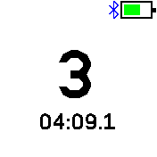

# Lap Counter

Click button to count laps (e.g. in a swimming pool).
Also shows total duration snapshot (like a stopwatch, but laid back).

## Usage

* Click BTN1 to start counting. Counter becomes `0`, duration becomes `00:00.0`
* Each time you click BTN1, counter is incremented, and you see duration between first and last clicks.

## Features

Disables LCD timeout (so that you can be _sure_ what BTN1 would do).

## Creator

[Nimrod Kerrett](https://zzzen.com)
