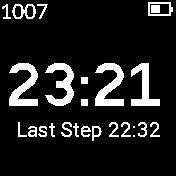

# Lazybones

'Warns when you have been sat still for too long.'

- Spending too much time sat down is destructive to our health and fitness.
- Lazy bones checks the step count every minute and if this
  has not changed after 26 minutes the buzzer will sound and a pop up
  screen will show.
- It gives 3 warnings before giving up
- Standing up and walking around until the step counting threshold is reached will automatically dismiss the warning.
- When the warning is not displaying the apps is a simple clock
- The timer only goes off between the hours 9am to 9pm.
- The app is a basic proof of concept that can be used in other clocks
- A settings menu may be added in a future release

## Dedication

This is app is dedicated in memory of my friend, Huw Evans 1960-2019,
poet, writer, actor, archiologist, technical author, husband, father,
friend.

In May 2017, Huw Evans received a terminal cancer diagnosis.  [Not
Long Now](https://www.youtube.com/watch?v=HD_Xysb6ZEA) is his
response to that diagnosis and the drastic shortening of his life
expectancy.  Not Long Now is a one-man show, which uses poetry,
story-telling, puppetry and video to address one basic question:
given we are all going to die, how then shall we live?

## Why the Skull ?

The Skull is a [Memento
mori](https://en.wikipedia.org/wiki/Memento_mori) (Latin for
'remember that you [have to] die') is an artistic or symbolic trope
acting as a reminder of the inevitability of death.

Let us choose not to die from sitting too long.

Written by: [Hugh Barney](https://github.com/hughbarney)  For support and discussion please post in the [Bangle JS Forum](http://forum.espruino.com/microcosms/1424/)
