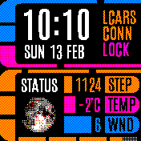
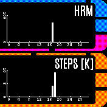

# LCARS clock

A simple LCARS inspired clock.
Note: To display the steps, the wpedom app is required. To show weather data
such as temperature, humidity or window you BangleJS must be connected
with Gadgetbride and the weather app must be installed.

## Control
 * Tap left / right to change between screens.
 * Tap top / bottom to control the current screen.

## Features
 * LCARS Style watch face.
 * Enable or disable fullscreen mode (widgets are always loaded, but hidden if fullscreen).
 * Tab on left/right to switch between different screens.
 * Cusomizable data that is shown on screen 1 (steps, weather etc.)
 * Shows random and real images of planets.
 * Tap on top/bottom of screen 1 to activate an alarm.
 * The lower orange line indicates the battery level.
 * Display graphs (day or month) for steps + hrm on the second screen.

## Data that can be configured
 * Steps - Steps loaded via the wpedom app.
 * Battery - Current battery level in %
 * VREF - Voltage of battery
 * HRM - Last measured HRM
 * Temp - Weather temperature loaded via the weather module + gadgetbridge
 * Humidity - Humidity loaded via the weather module + gadgetbridge
 * Wind - Wind loaded via the weather module + gadgetbridge. Set kph / mph in the settings.
 * Altitude - Shows the altitude in m.
 * CoreT - Temperature of device

## Multiple screens support
Access different screens via tap on the left/ right side of the screen

## Contributors
- [David Peer](https://github.com/peerdavid).
- [Adam Schmalhofer](https://github.com/adamschmalhofer).
- [Jon Warrington](https://github.com/BartokW).
