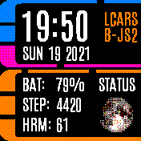

# LCARS clock

A simple LCARS inspired clock.
Note: To display the steps, its necessary to install
the [Pedometer widget](https://banglejs.com/apps/#pedometer%20widget).
To display the month graphs on screen 2, the health app is required.
Nevertheless, lcars can also be used, with limited functionality, without
installing those apps.

## Features
 * LCARS Style watch face.
 * Full screen mode - widgets are still loaded.
 * Supports multiple screens with different data.
 * [Screen 1] Date + Time + Lock status.
 * [Screen 1] Shows randomly images of real planets.
 * [Screen 1] Shows different states such as (charging, out of battery, GPS on etc.)
 * [Screen 1] Swipe up/down to activate an alarm.
 * [Screen 1] Shows 3 customizable datapoints on the first screen.
 * [Screen 2] Display month graphs for steps + hrm on the second screen.

## Multiple screens support
Access different screens via swipe left/ right

## Icons

Icons made by <a href="https://www.flaticon.com/authors/smashicons" title="Smashicons">Smashicons</a>, <a href="https://www.freepik.com" title="Freepik">Freepik</a> from <a href="https://www.flaticon.com/" title="Flaticon">www.flaticon.com</a>

## Creator
Made by [David Peer](https://github.com/peerdavid)