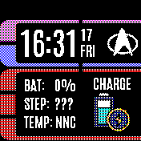

# LCARS clock

A simple LCARS inspired clock.
Note: To display the steps, its necessary to install
the [Pedometer widget](https://banglejs.com/apps/#pedometer%20widget).
To display the month graphs on screen 2, the health app is required.
Nevertheless, lcars can also be used, with limited functionality, without
installing those apps.

## Features
 * LCARS Style watch face
 * Shows different states (charging, out of battery, GPS on etc.)
 * Shows customizable data (steps, HRM, battery, temperature etc.)
 * Change between multiple screens via swipe left/right.
 * Display month graphs for steps + hrm on screen 2.
 * Swipe up/down to activate an alarm.
 * Full-screen mode.

## Multiple screens support
Access different screens via swipe left/ right

## Icons

Icons made by <a href="https://www.flaticon.com/authors/smashicons" title="Smashicons">Smashicons</a>, <a href="https://www.freepik.com" title="Freepik">Freepik</a> from <a href="https://www.flaticon.com/" title="Flaticon">www.flaticon.com</a>

## Creator
Made by [David Peer](https://github.com/peerdavid)