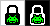

# Light Switch Widget

With this widget I wanted to create a solution to quickly en-/disable the LCD backlight and even change the brightness.
In addition it shows the lock status with the option to personalize the lock icon with a tiny image.

All touch and drag inputs related to this widget are cached/masked to prevent actions in the active app.
(See [espruino/Espruino#2151](https://github.com/espruino/Espruino/issues/2151) for more information.)

---
### Control
---
* __On / off__
  Single touch the widget to en-/disable the backlight.
* __Change brightness__ _(can be disabled)_
  First touch the widget, then quickly touch the screen again and drag up/down until you reach your wished brigthness.
* __Double tap to flash backlight__ _(can be disabled)_
  By defaut you can double tap on the right side of your bangle to flash the backlight for a short duration.
  (While the backlight is active your bangle will be unlocked.)
* __Double tap to unlock__ _(disabled by default)_
  If a side is defined in the app settings, your bangle will be unlocked if you double tap on that side.

---
### Settings
---
#### Widget - Change the apperance of the widget:
* __Bulb col__
  _red_ / _yellow_ / _green_ / __cyan__ / _blue_ / _magenta_
  Define the color used for the lightbulbs inner circle.
  The selected color will be dimmed depending on the actual brightness value.
* __Image__
  __default__ / _random_ / _..._
  Set your favourite lock icon image. (If no image file is found _no image_ will be displayed.)
    * _random_ -> Select a random image on each time the widget is drawn.

#### Control - Change when and how to use the widget:
* __Touch__
  _on def clk_ / _on all clk_ / _clk+setting_ / _clk+launch_ / _except apps_ / __always on__
  Select when touching the widget is active to en-/disable the backlight.
    * _on def clk_ -> only on your selected main clock face
    * _on all clk_ -> on all apps of the type _clock_
    * _clk+setting_ -> on all apps of the type _clock_ and in the settings
    * _clk+launch_ -> on all apps of the types _clock_ and _launch_
    * _except apps_ -> on all apps of the types _clock_ and _launch_ and in the settings
    * _always on_ -> always enabled when the widget is displayed
* __Oversize__
  _0px_ / _1px_ / _..._ / __20px__ / _..._ / _50px_
  To make it easier to hit the widget, this value extends the touch area of the widget in all directions.
* __Drag Delay__
  _off_ / _50ms_ / _100ms_ / _..._ / __500ms__ / _..._ / _1000ms_
  Change the maximum delay between first touch and re-touch/drag to change the brightness or disable changing the brightness completely.
* __Min Value__
  _1%_ / _2%_ / _..._ / __10%__ / _..._ / _100%_
 Set the minimal level of brightness you can change to.
* __Tap to lock__
 Tapping the widget locks the screen, rather than toggling brightness.

#### Unlock - Set double tap side to unlock:
* __TapSide__
  __off__ / _left_ / _right_ / _top_ / _bottom_ / _front_ / _back_

#### Flash - Change if and how to flash the backlight:
* __TapSide__
  _off_ / _left_ / __right__ / _top_ / _bottom_ / _front_ / _back_
  Set double tap side to flash the backlight or disable completely.
* __Tap__
  _on locked_ / _on unlocked_ / __always on__
  Select when a double tap is recognised.
* __Timeout__
  _0.5s_ / _1s_ / _..._ / __2s__ / _..._ / _10s_
  Change how long the backlight will be activated on a flash.
* __Min Value__
  _1%_ / _2%_ / _..._ / __20%__ / _..._ / _100%_
  Set the minimal level of brightness for the backlight on a flash.

---
### Images
---

|           Lightbulb           |    Default lock icon    |
|:-----------------------------:|:-----------------------:|
|      |  |
| ( _full_ / _dimmed_ / _off_ ) |    ( _on_ / _off_ )     |

Examples in default light and dark theme.

| Lock | Heart | Invader | JS | Smiley | Skull | Storm |
|:----:|:-----:|:-------:|:--:|:------:|:-----:|:-----:|
|  |  |  |  |  |  |  |

This images are stored in a seperate file _(lightswitch.images.json)_.

---
### Worth Mentioning
---
#### To do list
* Manage images for the lock icon through a _Customize and Upload App_ page.

#### Requests, Bugs and Feedback
Please leave requests and bug reports by raising an issue at [github.com/storm64/BangleApps](https://github.com/storm64/BangleApps) or send me a [mail](mailto:banglejs@storm64.de).

#### Thanks
Huge thanks to Gordon Williams and all the motivated developers.

#### Creator
Storm64 ([Mail](mailto:banglejs@storm64.de), [github](https://github.com/storm64))

#### License
[MIT License](LICENSE)
