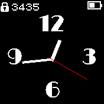
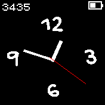
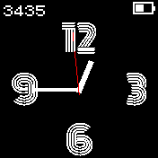
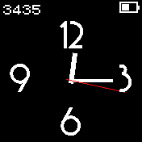

# Limelight
 *Simple configurable analogue clock based on the work of @Andreas_Rozek [Simple_Clock](https://github.com/espruino/BangleApps/tree/master/apps/simple_clock)*

* Selection of different fonts
* Settings menu where you can select font, or switch to Vector font and try a range of sizes
* Reduction by 100 lines of code, demonstrating that there is no need for a custom widget draw method
* Full screen option (widgets are loaded but not displayed)

Many thanks for @Andreas_Rozek for his pioneering work on building an analogue clock toolkit for the Bangle 2.

Limelight Written by: [Hugh Barney](https://github.com/hughbarney) For support and discussion please post in the [Bangle JS
Forum](http://forum.espruino.com/microcosms/1424/)

