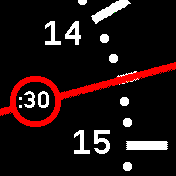
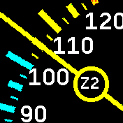
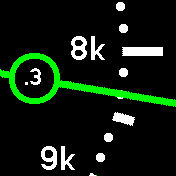
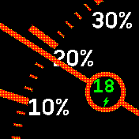

# Line Dash

A beautiful analog clock with swipeable stats dashboards for Bangle.js 2.

Line Dash provides a suite of minimalist gauges that you can swipe through to check your daily stats. It features a clean design where each metric gets its own dedicated screen, keeping your main clock face completely uncluttered. The app is intentionally full-screen and does not display widgets.

## Screenshots

| Clock | Heart Rate | Steps | Battery |
| :---: | :---: | :---: | :---: |
|  |  |  |  |

## Features

* **Clock:** A clean, easy-to-read analog clock face that automatically inherits your system's 12/24 hour preference. Tap to briefly show the date (weekday and day/month, following your system language).
* **Steps:** Tracks your daily steps using a sweeping dial.
* **Distance:** Shows the distance covered today, plus an optional trip meter: swipe up to start a trip ("count from here"), swipe down to return to the day total — the trip keeps running in the background. Tapping in the trip view asks to reset the trip (a RESET? popup); confirm with one more tap, or dismiss it by swiping down or waiting. The trip view is marked with a TRIP indicator, survives app reloads, and automatically ends at midnight.
* **Heart Rate:** Features a color-coded HR Zone gauge. The HR sensor only activates when you swipe to this screen to conserve battery. *(Note: The "Live HR Updates" feature is highly recommended but disabled by default to save power. Be sure to enable it in the app settings!)*
* **Barometer:** Shows the current air pressure on a 300-degree 950-1050 hPa dial using the built-in pressure sensor. The wide sweep makes small pressure changes easy to spot. The dial gives the hundreds, while the center circle shows the last two digits of the reading (e.g. "13" for 1013 hPa). Tap to briefly show the exact reading. Swipe up for the altimeter sub-view (recognizable by its unit-suffixed labels), laid out like an aircraft altimeter: 0 sits at the 12 o'clock position and one full revolution of the dial covers 100 meters or feet (selectable in the settings), with ticks every 10 units. The circle shows the hundreds, the needle is lightly smoothed against sensor noise, and a tap shows the exact altitude; swipe down returns to the pressure dial. The reading can be calibrated to sea level in the settings, so it matches your local weather report (this also serves as the altimeter reference). The sensor only runs while this screen is shown, and while the watch is locked it drops to a single reading per minute to save power.
* **Resume:** Line Dash remembers which screen you were on across app reloads — get a message while checking your heart rate mid-run, and you will return straight to the HRM gauge (with the sensor re-enabled).
* **Battery:** Displays your current battery level in a classic 180-degree "fuel gauge" layout with fixed color zones on the dial: green above 30%, a yellow warning band down to 15%, and a red reserve below — needle and center circle take the color of the current zone. When you plug in your watch, the app automatically switches to this dashboard and displays a dynamic green charging indicator. Unplugging it automatically returns you to the main clock!

## Controls

* **Swipe Left / Right:** Cycle through the different dashboard gauges.
* **Tap (Clock):** Shows the date for a few seconds; tap again to dismiss it early.
* **Tap (Barometer):** Shows the exact pressure reading — or, in the altimeter view, the exact altitude — for a few seconds; tap again to dismiss it early.
* **Tap (Distance, trip view):** Shows a RESET? popup; one more tap within 3 seconds resets the trip.
* **Swipe Up / Down (Barometer):** Switches between the pressure dial and the altimeter sub-view.
* **Swipe Up (Distance):** Switches to the trip meter — starts a trip if none is running.
* **Swipe Down (Distance):** Dismisses the RESET? popup, or switches back to the day total without resetting the trip.

## Customization

The app includes a comprehensive settings menu where you can configure the following options:

* **Show Lock:** Display a padlock icon when the screen is locked.
* **Show Minute:** Toggle the digital minute display in the center of the clock gauge.
* **Distance Unit:** Manually override the distance unit to `km` or `mi`.
* **Show Distance:** Enable or disable the Distance Trip Meter screen.
* **Stride (m):** Set your personal stride length (0.40m to 1.20m) for accurate distance calculation.
* **Show Steps:** Enable or disable the Steps gauge screen.
* **Show Battery:** Enable or disable the Battery gauge screen.
* **Show Heart Rate:** Enable or disable the Heart Rate gauge screen.
* **Show Barometer:** Enable or disable the Barometer gauge screen.
* **Altitude Unit:** Show the altimeter in meters (`m`) or feet (`ft`).
* **Sea level (hPa):** Calibrate the barometer against your local weather report. The menu takes a reading when opened; set the value your weather report gives for the current sea-level pressure, and the app derives a constant correction covering both your altitude and the sensor offset. The entered value also becomes the reference for the altitude overlay (recalibrate before relying on it, as weather changes shift the estimate by roughly 8m per hPa).
* **Live HR Updates:** Toggle whether the Heart Rate gauge updates live while viewing it.
* **Live HR Interval:** If Live HR is enabled, select how often the gauge redraws (2s, 5s, 15s, 30s, 60s, 90s, or 120s).
* **HR Age Decade:** Select your age decade (20s, 30s, 40s, 50s, 60s, 70s, or 80s) to accurately calculate your Max HR and corresponding HR Zones.

### Calibrating the Barometer

1. Look up the current air pressure for your town in any weather app or report (e.g. 1014 hPa). Weather reports always give the sea-level value, which is exactly what you need.
2. On the watch, open *Settings → Apps → Line Dash → Sea level (hPa)*. The entry shows "wait..." for a second while a reading is taken, then the current calibrated value.
3. Set it to the value from your weather report. Done.

The correction is a constant for your location — it covers both your altitude above sea level and the sensor's individual offset — so the displayed pressure keeps matching the weather report even as the weather changes. Recalibrate only after moving to a different altitude, or right before a hike if you want the altitude overlay to start as accurately as possible (weather changes shift the altitude estimate by roughly 8 m per hPa).

## Credits

Line Dash was created by [pagnotta](https://github.com/pagnotta), built upon the foundation of the [Line Clock](https://github.com/espruino/BangleApps/tree/master/apps/line_clock) app originally created by deepDiverPaul. It has been expanded into a suite of interactive, swipeable dashboard gauges.

## License

This app is released under the [MIT License](LICENSE).
