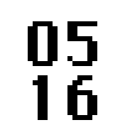

# MacWatch

A very simple clock using big numbers in the original Macintosh Chicago font.

Touch the screen to show the date in numerical format.

Touch the screen again to revert to the time.

Time updates every 15 seconds.

## In dark mode

## In light mode

## The watch in use

## Creator

Written by Giles Booth | [twitter](https://twitter.com/blogmywiki) | [blog](http://www.suppertime.co.uk/blogmywiki/)
