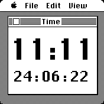

# MacWatch2

A clock inspired by Susan Kare's original 1984 Macintosh desktop design.

Ideas for development:
- [x] fix dark mode either by forcing black on white or doing proper inverse display and text
- [ ] date in text format
- [ ] tap to load different info in window
- [ ] unlock to show seconds, perhaps flip time and date?
- [ ] incorporate widgets somehow either by leaving space or adding Chicago font widgets of my own in top bar

## Creator

Written by Giles Booth | [twitter](https://twitter.com/blogmywiki) | [blog](http://www.suppertime.co.uk/blogmywiki/)
Improvements for accuracy, dark mode and widgets running in background by [Peer David](https://gist.github.com/peerdavid)
