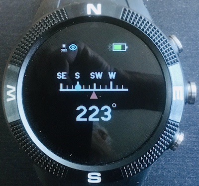

# Navigation Compass

This is a tilt and roll compensated compass with a linear display. The compass will  display the same direction that it shows when flat as when it is tilted (rotation around the W-S axis) or rolled (rotation around the N-S) axis. *Even with compensation, it would be beyond foolish to rely solely on this app for any serious navigational purpose.*

## Calibration

Correct operation of this app depends critically on calibration. When first run on a Bangle, the app will request calibration. This lasts for 20 seconds during which you should move the watch slowly through figures of 8. It is important that during calibration the watch is  fully rotated around each of it axes. If the app does give the correct direction heading or is not stable with respect to tilt and roll - redo the calibration by pressing *BTN2*. Calibration data is recorded in a storage file named `magnav.json`. 

Note: Charging your Bangle due to the magnetic connector clamp seems to require recalibration afterwards for accurate readings.

## Controls

*BTN1* - marks the current heading with a blue circle - see screen shot. This can be used to take a bearing and then follow it..
(Swipe UP on Bangle 2)

*BTN2* - invokes calibration ( can be cancelled if pressed accidentally).
(*BTN1* on Bangle 2)

*BTN3* - cancels the marker (blue circle not displayed)
(swipe DOWN on Bangle 2)

## Support

Please report bugs etc. by raising an issue [here](https://github.com/jeffmer/JeffsBangleAppsDev).