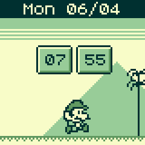

# Mario Clock
Let's go back in time with this Gameboy inspired Mario retro clock.

Enjoy watching Mario, or one of the other game characters run through a level while showing you the time and date.

## Features

* Multiple characters - swipe the screen right to change the character between `Mario`, `Toad`, and `Daisy`
* Night and Day modes - swipe left to enter night mode, with 3 levels of darkness before returning to day mode.
* Smooth animation
* Awesome 8-bit style grey-scale graphics
* Mario jumps to change the time, every minute
* You can make Mario jump by pressing the bottom button (Button 3) on the watch
* Toggle the info pannel bettween `Date`, `Battery level`, and `Temperature` by pressing the top button (Button 1)
* If you have [GadgetBridge](https://f-droid.org/packages/nodomain.freeyourgadget.gadgetbridge/) installed on your phone, Mario will let you know when you get a new call or notification. You can clear a message by pressing either Button 1 or Button 3

## Requests

If you have any feature requests, please send an email to the author `paulcockrell@gmail.com`
