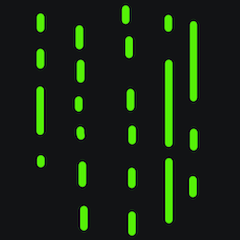
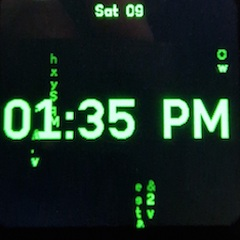
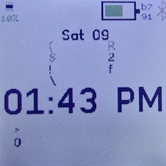
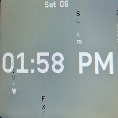

# Matrix Clock

## Settings
Please use the setting->App->Matrix Clock Menu to change the settings

| Setting     | Description                                                                                                        |
|-------------|--------------------------------------------------------------------------------------------------------------------|
| Color       | By default set to **'theme'** to follow the theme colors. Selector also offers a selection of other colour schemes |
| Time Format | Choose between 12 hour and 24 hour time format                                                                     |
| Intensity   | Changes the number of matrix streams that are falling                                                              |

## Colour Themes

Some of the colours schemes that are available from the settings screen

|  |  |      |
|-------------------------------|-------------------------------|-----|
| green on black                | white on black                |   white on gray  |

## Requests

Please reach out to adrian@adriankirk.com if you have feature requests or notice bugs.

## Creator

Made by [Adrian Kirk](mailto:adrian@adriankirk.com)
