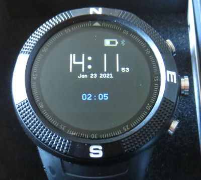

# Morphing Clock Plus

Based on Morphing Clock with more readable seconds and date, and an additional simple stopwatch.

## Usage

In addition to the Morphing Clock, a simple stopwatch can be started in the lower part of the display.

BTN3 starts and stops the stopwatch.

BTN1 resets/clears the stopwatch.

## Requests

Please leave bug reports and requests by raising an issue [here](https://github.com/skauertz/BangleApps).

## Creator

Sebastian Kauertz  https://github.com/skauertz
