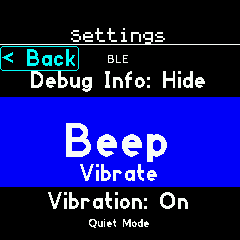
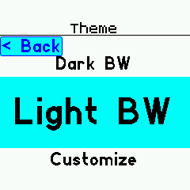
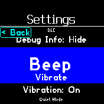
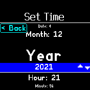
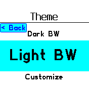

# Wheel Menu

Replace Bangle.js 2's menus with a version that contains variable-size text and a back button.

Bangle.js 1:   

Bangle.js 2:   

## Features

If the menu contains "Back" or "Exit", it is shown as a button instead.   
The menu wraps around, with a divider between the last and first items.

## Controls

Bangle.js 1: Use BTN1/BTN3 to scroll through items, BTN2 to open/edit the selected item.   
Bangle.js 2: Swipe up/down to scroll through items, tap/BTN to open/edit the selected item.   

Press the back button (if present) to go back.