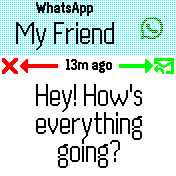
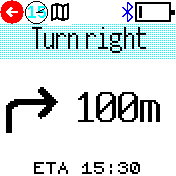

# Messages app

Default app to handle the display of messages and message notifications. It allows 
them to be listed, viewed, and responded to.
It is installed automatically if you install `Android Integration` or `iOS Integration`.

It is a replacement for the old `notify`/`gadgetbridge` apps.

## Settings

You can change settings by going to the global `Settings` app, then `App Settings`
and `Messages`:

* `Vibrate` - This is the pattern of buzzes that should be made when a new message is received
* `Vibrate for calls` - This is the pattern of buzzes that should be made when an incoming call is received
* `Repeat` - How often should buzzes repeat - the default of 4 means the Bangle will buzz every 4 seconds
* `Vibrate Timer` - When a new message is received when in a non-clock app, we display the message icon and
buzz every `Repeat` seconds. This is how long we continue to do that.
* `Unread Timer` - When a new message is received when showing the clock we go into the Messages app.
If there is no user input for this amount of time then the app will exit and return
to the clock where a ringing bell will be shown in the Widget bar.
* `Min Font` - The minimum font size used when displaying messages on the screen. A bigger font
is chosen if there isn't much message text, but this specifies the smallest the font should get before
it starts getting clipped.
* `Auto-Open Music` - Should the app automatically open when the phone starts playing music?
* `Unlock Watch` - Should the app unlock the watch when a new message arrives, so you can touch the buttons at the bottom of the app?

## New Messages

When a new message is received:

* If you're in an app, the Bangle will buzz and a message icon appears in the Widget bar. You can tap this icon to view the message.
* If you're in a clock, the Messages app will automatically start and show the message

When a message is shown, you'll see a screen showing the message title and text.

* The 'back-arrow' button (or physical button on Bangle.js 2) goes back to Messages, marking the current message as read.
* The top-left icon shows more options, for instance deleting the message of marking unread
* On Bangle.js 2 you can tap on the message body to view a scrollable version of the title and text (or can use the top-left icon + `View Message`)
- On Bangle.js 2 swipe up/down to show newer/older message
* If shown, the 'tick' button:
   * **Android** opens the notification on the phone
   * **iOS** responds positively to the notification (accept call/etc)
* If shown, the 'cross' button:
   * **Android** dismisses the notification on the phone
   * **iOS** responds negatively to the notification (dismiss call/etc)

## Images
_1. Screenshot of a message notification_

_2. Screenshot of a navigation notification_

## Requests

Please file any issues on https://github.com/espruino/BangleApps/issues/new?title=messages%20app

## Creator

Gordon Williams

## Contributors

[Jeroen Peters](https://github.com/jeroenpeters1986)

## Attributions

Icons used in this app are from https://icons8.com
