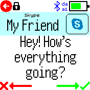

# Messages app

Default app to handle the display of messages and message notifications. It allows
them to be listed, viewed, and responded to.
It is installed automatically if you install `Android Integration` or `iOS Integration`.

It is a replacement for the old `notify`/`gadgetbridge` apps.

## Settings

You can change settings by going to the global `Settings` app, then `App Settings`
and `Messages`. See the [Messages App Readme](https://banglejs.com/apps/?id=messages&readme)
for more information.

## New Messages

When a new message is received:

* If you're in an app, the Bangle will buzz and a message icon appears in the Widget bar. You can tap this icon to view the message.
* If you're in a clock, the Messages app will automatically start and show the message

When a message is shown, you'll see a screen showing the message title and text.

* The 'back-arrow' button (or physical button on Bangle.js 2) goes back to Messages, marking the current message as read.
* Tapping the title bar shows more options, for instance deleting the message of marking unread
* On Bangle.js 2:
  * Dragging up/down will show more or the current message
  * Swipe up/down at the beginning/end of a message to show newer/older message
* On Bangle.js 1:
  * Pressing top/bottom buttons will show more or the current message
* If shown, the 'tick' button:
   * **Android** opens the notification on the phone
   * **iOS** responds positively to the notification (accept call/etc)
* If shown, the 'cross' button:
   * **Android** dismisses the notification on the phone
   * **iOS** responds negatively to the notification (dismiss call/etc)

## Images
_1. Screenshot of a message notification_

_2. Screenshot of a navigation notification_

## Requests

Please file any issues on https://github.com/espruino/BangleApps/issues/new?title=messages%20app

## Creator

Gordon Williams

## Contributors

[Jeroen Peters](https://github.com/jeroenpeters1986)

## Attributions

Icons used in this app are from https://icons8.com
