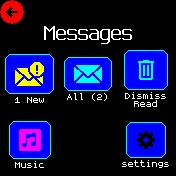

# Message List

Display messages inline as a single list:   
Displays one message at a time, if it doesn't fit on the screen you can scroll
up/down.  When you reach the bottom, you can scroll on to the next message.

## Installation
**First** uninstall the default [Message UI](/?id=messagegui) app (`messagegui`,
not the library!).   
Then install this app.

## Screenshots

### Main menu:   

### Unread message:   
   
The chevrons are hints for swipe actions:
- Swipe right to go back
- Swipe left for the message-actions menu
- Swipe down to show the previous message: We are currently viewing message 2 of 2,
  so message 1 is "above" this one.

### Long (read) message:   
   
The button is disabled until you scroll all the way to the bottom.

### Music:   
   
Minimal setup: album name and buttons disabled through settings.
Swipe for next/previous song, tap to pause/resume.

## Settings

### Interface
* `Font size` - The font size used when displaying messages/music.
* `On Tap` - If messages are too large to fit on the screen, tapping the screen scrolls down.    
  This is the action to take when tapping a message after reaching the bottom:
  - `Message menu`: Open menu with message actions
  - `Dismiss`: Dismiss message right away
  - `Back`: Go back to clock/main menu
  - `Nothing`: Do nothing
* `Dismiss button` - Show inline button to dismiss message right away

### Behaviour
* `Vibrate` - The pattern of buzzes when a new message is received.
* `Vibrate for calls` - The pattern of buzzes for incoming calls.
* `Vibrate for alarms` - The pattern of buzzes for (phone) alarms.
* `Repeat` - How often buzzes repeat - the default of 4 means the Bangle will buzz every 4 seconds.
* `Unread timer` - When a new message is received the Messages app is opened.
  If there is no user input for this amount of time then the app will exit and return to the clock.
* `Auto-open` - Automatically open app when a new message arrives.
* `Respect quiet mode` - Prevent auto-opening during quiet mode.

### Music
* `Auto-open` - Automatically open app when music starts playing.
* `Always visible` - Show "music" in the main menu even when nothing is playing.
* `Buttons` - Show `previous`/`play/pause`/`next` buttons on music screen.
* `Show album` - Display album names?

### Util
* `Delete all` - Erase all messages.

## Attributions

Some icons used in this app are from https://icons8.com
