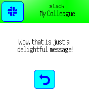
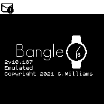

# Messages app

This app handles the display of messages and message notifications. It stores
a list of currently received messages and allows them to be listed, viewed,
and responded to.

It is a replacement for the old `notify`/`gadgetbridge` apps.

## Settings

You can change settings by going to the global `Settings` app, then `App Settings`
and `Messages`:

* `Vibrate` - This is the pattern of buzzes that should be made when a new message is received
* `Repeat` - How often should buzzes repeat - the default of 4 means the Bangle will buzz every 4 seconds
* `Unread Timer` - when a new message is received we go into the Messages app.
If there is no user input for this amount of time then the app will exit and return
to the clock where a ringing bell will be shown in the Widget bar.

## Images
_1. Screenshot of a notification_

_2. What the notify icon looks like (it's touchable on Bangle.js2!)_

## Requests

Please file any issues on https://github.com/espruino/BangleApps/issues/new?title=messages%20app

## Creator

Gordon Williams

## Contributors

[Jeroen Peters](https://github.com/jeroenpeters1986)

## Attributions

Icons used in this app are from https://icons8.com
