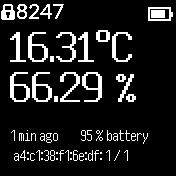

# MiTherm

Reads BLE advertisement data from Xiaomi temperature/humidity sensors running the
`pvvx` custom firmware (https://github.com/pvvx/ATC_MiThermometer).

NOTE: If you flash your Mi Temperature device to the `pvvx` firmware,
please ensure you disconnect it from your bluetooth source before
attempting to run the app on the Bangle.

## Features

* Display temperature
* Display humidity
* Display battery state of sensor
* Auto-refresh every 5 minutes
* Manual refresh on demand
* Add aliases for MAC addresses to easily recognise devices

## Planned features

* Supprt for other advertising formats:
  * atc1441 format
  * BTHome
  * Xiaomi Mijia format
* Configurable auto-refresh interval
* Configurable scan length (currently 30s)
* Alerts when temperature outside defined limits (with a widget or bootcode to
  work when app is inactive)

