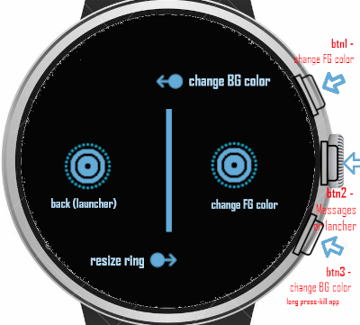

# Mix Digital & Analog Clock
A dual and simultaneous Analog and Digital Clock, also shows day, month and year.
Color are automatically set depending on the configured Theme or device, bunt also change on realtime through touching the right side.

Compatible with BangleJS1,BangleJS2,and EMSCRIPTENx emulators

## Pictures:

Bangle.JS1

UI for bangleJS1

UI for bangleJS2

Screenshot emulator (BJS2)

Screenshot emulator (BJS1)

SS emulator (BJS1) -color ans aspect changed

SS emulator (BJS1) -Background color changed

SS emulator (BJS2)  -color change 

SS emulator (BJS2) -Background color changed 

SS emulator (BJS2) -color changed 

## Usage

Open and see 

## Features

 - Compatibility with different smartwatch models
  - Dynamic positions x,y for different devices
  - Dynamic Colours (FG and BG) and positions
 - Realtime configuration
 - Support for bottom widgets
 - Shortcut to messages app

## Controls/UI

 - BTN1 (BJS2): "Launcher" / open "Messages"
 - BTN2 (BJS1): "Launcher" / open "Messages"
 - BTN1 (BJS1): Change FG Color
 - BTN3 (BJS1): Change BG Color
 - Left area: Back/Exit/launcher 
 - Right area: Change FG Color 
 - Swipe left: Change BG Color 
 - Swipe right: Increase/Decrease Hour circle/Points 
 
 - BTN3 (long press)(BJS1): default Exit/kill app 

## Coming soon
A better combination of colors and aspect for the initial screen (help of designer is welcome)

## Support

This app is so basic that probably the easiest is to just edit the code ;)

Otherwise you can submit issues, request features or make suggestions  [here](https://github.com/dapgo/my_espruino_smartwatch_things) or in the global bangle.apps repository