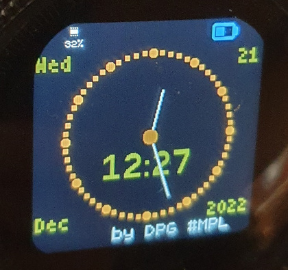

# Mix Digital & Analog Clock
A dual and simultaneous Analog and Digital Clock, also shows day, month and year.
Color are automatically set depending on the configured Theme or device, bunt also change on realtime through touching the right side.

Compatible with BangleJS1,BangleJS2,and EMSCRIPTENx emulators

## Pictures:

Bangle JS1

Screenshot emulator BJS2

Screenshot emulator BJS1

SS emulator -color change 

SS emulator -color change 

SS emulator -color change 

## Usage

Open and see 

## Features

Compatibility with devices
Dynamic Colours and positions
Support for bottom widgets

## Controls

Exit : BTN2 (BJS1)
Exit/launcher : left area 
Change Color : right area
Increase Hour Points : swipe right
Decrease Hour Points : swipe left

## Coming soon
A better color combination

## Support

This app is so basic that probably the easiest is to just edit the code ;)

Otherwise you can contact me [here](https://github.com/dapgo/my_espruino_smartwatch_things)