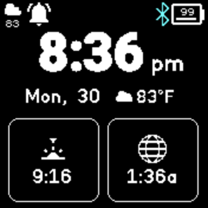

# Modern Clock

A beautifully simple, modern clock with three Clock Infos, and a clean UI. Fast-Loads.

## Features

* Has 3 Clock Infos, that are individually changeable.
* Has an inline Clock Info, next to the date, for quick, glanceable data.
* Low battery consumption.
* Uses locale for time and date.
* Bold time font, for quicker readability.
* Uses rounded rectangles and a bold font for a simple, clean, modern look.
* Has Fast Loading, for quicker access to launcher.

## Settings
### Accent Color
- The color clockInfos draw as when focused (tapped or changed).
## Creator

RKBoss6

Github: https://github.com/RKBoss6
