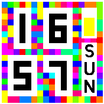

# Mosaic Clock +

A fabulously colourful clock, now with battery bar and day of the week!

Based on Mosaic Clock by [Sir Indy](https://github.com/sir-indy), with some slight modifcations.

Original features:
* Clearly shows the time on a colourful background that changes every minute.
* Dark and Light theme compatible, with a setting to override the digit colour scheme.
* Show or hide widgets with a setting (default hides widgets, swipe down to show them thanks to `widget_utils`).

PLUS:
* Battery bar
* Three-digit weekday

This clock is inspired by the mosaic watchface for pebble: https://apps.rebble.io/en_US/application/55386bcd2aead62b16000028

Written by: [Sir Indy](https://github.com/sir-indy) 
Modified by: [steeb-k](https://github.com/steeb-k) 
