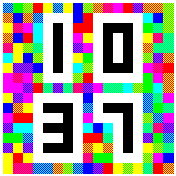
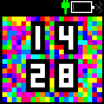

# Mosaic Clock

A fabulously colourful clock!

* Clearly shows the time on a colourful background that changes every minute.
* Dark and Light theme compatible, with a setting to override the digit colour scheme.
* Show or hide widgets with a setting (default hides widgets, swipe down to show them thanks to `widget_utils`).

This clock is inspired by the mosaic watchface for pebble: https://apps.rebble.io/en_US/application/55386bcd2aead62b16000028

Written by: [Sir Indy](https://github.com/sir-indy) For support and discussion please post in the [Bangle JS Forum](http://forum.espruino.com/microcosms/1424/)
