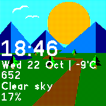
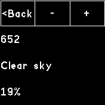

# Mountain Pass Clock

Based on the Pebble watchface Weather Land.

Mountain Pass Clock changes depending on time (day/night) and weather conditions.

This clock requires Gadgetbridge and an app that Gadgetbridge can use to get the current weather from OpenWeatherMap (e.g. Weather Notification), or a Bangle app that will update weather.json such as OWM Weather. To set up Gadgetbridge and weather, see https://codeberg.org/Freeyourgadget/Gadgetbridge/wiki/Weather.

The scene will change according to the following OpenWeatherMap conditions: clear, cloudy, overcast, lightning, drizzle, rain, fog and snow. Each weather condition has night/day scenes.

If you choose not to set up weather (or are not connected to Gadgetbridge, for that matter), this clock will default to clear weather, and the scenery will still change from night to day.

You can add up to three clockinfos under the time, date, and weather. Accessing the menu to do so is done by tapping, or long-tapping on the Bangle.js 2.

Special thanks to Serj for testing this on the original Bangle.

## Images

