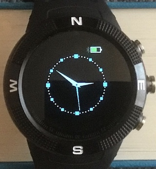
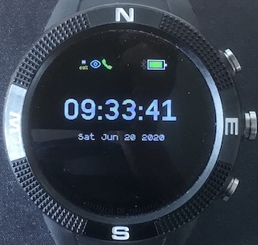
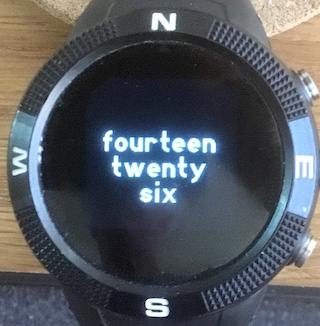

# Multiclock

This is a clock app that supports multiple clock faces. The user can switch between faces while retaining widget state which makes the switch fast and preserves state such as bluetooth connections. Currently there are four clock faces as shown below. To my eye, these faces look better when widgets are hidden using **widviz**. 

### Analog Clock Face


### Digital Clock Face


### Big Digit Clock Face


### Text Clock Face


## Controls
Clock faces are kept in a circular list.

*BTN1* - switches to the next clock face.

*BTN2* - switches to the app launcher.

*BTN3* - switches to the previous clock face.

## Adding a new face
Clock faces are described in javascript storage files named `name.face.js`. For example, the Analog Clock Face is described in `ana.face.js`. These files have the following structure:

```
(() => {
    function getFace(){
	    function onSecond(){
	       //draw digits, hands etc
	    }
	    function drawAll(){
	       //draw background + initial state of digits, hands etc
	    }
    	return {init:drawAll, tick:onSecond};
    }
    return getFace;
})();
```
For those familiar with the structure of widgets, this is similar, however, there is an additional level of function nesting. This means that although faces are loaded when the clock app starts running they are not instantiated until their `getFace` function is called, i.e.  memory is not allocated to structures such as image buffer arrays declared in `getFace` until the face is selected. Consequently, adding a face does not require a lot of extra memory. 

The app at start up loads all files `*.face.js`. The simplest way of adding a face is thus to load it into `Storage` using the WebIDE. Similarly, to remove an unwanted face, simply delete it from `Storage` using the WebIDE.

## Support

Please report bugs etc. by raising an issue [here](https://github.com/jeffmer/JeffsBangleAppsDev).