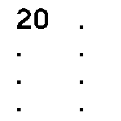
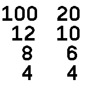
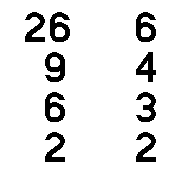

# multiple dice roller

roll anywhere from 1-8 dice at the same time.

## Usage

On the menu screen: tap on the dice to change what variant is selected, & shake/or press BTN to roll the dice

On the dice screen: tap anywhere on the screen to go back to the menu, or shake/or press BTN to roll the dice

## Features

roll anywhere from 1-8 dice (d4, d6, d8, d10, d12, d20, & d percentile). You can select multiple different dice at the same time

## Controls

App uses touchscreen to cycle through different dice, and accelerometer/BTN to roll them
