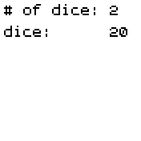
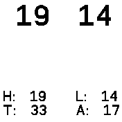
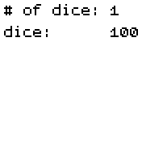

# multiple dice roller

roll anywhere from 1-6 dice at the same time, and display stats like the highest & lowest roll, the total sum of the dice, and the average of all the dice

## Usage

On the menu screen: tap to the right or left of the "# of dice" option to change how many dice to roll, & tap to the left or right of the "dice" option to select a different type (currently hard-coded to only allow DnD dice). To roll the dice, simply tap anywhere else on the screen. To go back to the dice selector.

Once you're no longer on the menu screen, tap anywhere on the screen to return to the menu (W.I.P: shaking the watch to allow rolling dice again without having to go to the menu every time)

## Features

roll anywhere from 1-6 dice (d4, d6, d8, d10, d12, d20, & d percentile). If only one dice is selected, it simply displays the output; if two or more dice are selected it also displays basic stats such as the highest & lowest roll, the total sum, and the average of all the dice.

## Controls

No button is used in the app, it simply uses touch controls (W.I.P: accelerometor to roll the dice & compatability with the bangle.js 1).

## Requests

Le3Kat@gmail.com

## Creator

Le~Kat
