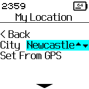
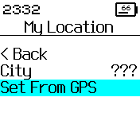
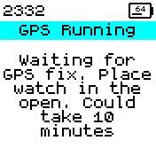
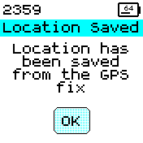

# My Location

*Sets and stores GPS lat and lon of your preferred city*

To access, you have two options:

**In the App Loader** once My Location is installed, click on the 'Save' icon
next to it - and you can choose your location on a map.

**On Bangle.js** go to `Settings -> Apps -> My Location`

* Select one of the preset Cities, setup through the GPS, waypoints (if installed) or use the webinterface from the AppLoader
* Other Apps can read this information to do calculations based on location
* When the City shows ??? it means the location has been set through the GPS

## Example Code

    const LOCATION_FILE = "mylocation.json";
    let location;

    // requires the myLocation app
    function loadLocation() {
      location = require("Storage").readJSON(LOCATION_FILE,1)||{"lat":51.5072,"lon":0.1276,"location":"London"};
    }

## Screenshots

### Select one of the Preset Cities

* The presets are London, Newcastle, Edinburgh, Paris, New York, Tokyo

### Or select 'Set By GPS' to start the GPS

### While the GPS is running you will see:

### When a GPS fix is received you will see:

Written by: [Hugh Barney](https://github.com/hughbarney)  For support and discussion please post in the [Bangle JS Forum](http://forum.espruino.com/microcosms/1424/)
