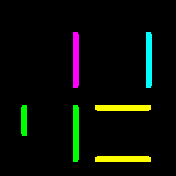
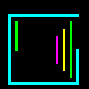

# Neon X and IO X Clock

|  |  |
|---------------------------------|--------------------------------------|
| 
Neon X
         | 
Neon IO X
           |

This is a clock based on Pebble's Neon X and Neon IO X watchfaces by Sam Jerichow.
Can be switched between in the Settings menu, which can be accessed through
the app/widget settings menu of the Bangle.js

## Settings

### Neon IO X:
Activate the Neon IO X clock look, a bit hard to read until one gets used to it.

### Thickness
The thickness of watch lines, from 1 to 6.

### Date on touch
Shows the current date as DD MM on touch and reverts back to time after 5 seconds or with another touch.

### Fullscreen
Shows the watchface in fullscreen mode.
Note: In fullscreen mode, widgets are hidden, but still loaded.

### Show lock status
If enabled, the lock/unlock event is animated by changing the colors.