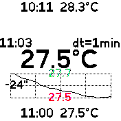
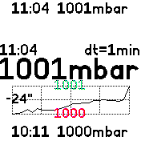

# The Nightwatch

Snuggle into your sleeping bag, hang the Bangle on the tent wall
and check the screen before you fall asleep:

Reads temperature and pressure sensor. Shows current, maximal and minimal values
since the start of the app. Also show a graph of the last 20 measures.

Swipe left/right between values.

Screen is updated periodically, time step is configurable in settings.

# Creator

[Niko Komin](https://www.laikaundfreunde.de/niko-komin/)
