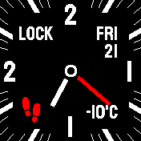
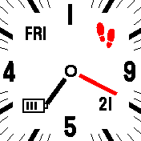
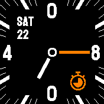

# Not Analog
An analog watch face for people (like me) that can not read analog watch faces.
It looks like an analog clock, but its not! It shows the time digital - check the
4 numbers on the watch face ;)

The red hand shows the number of steps (12k steps = 360 degrees) and the
black one the battery level (100% = 360 degrees).
The selected theme is also respected. Note that this watch face is in fullscreen
mode, but widgets are still loaded in background.

## Other Features
- Set a timer - simply touch top (+5min.) or bottom (-5 min.). This only works if "sched" is installed.
- If the weather is available through the weather app, the outside temp. will be shown.
- Sleep modus at midnight to save more battery (no minute updates).
- Icons for charging and GPS.
- If you have done more than 10k steps, the red hand and icon will turn green.
- Shows current lock status of your bangle va a colored dot in the middle.

## Screenshots

# Thanks
Thanks to the multiclock from https://github.com/jeffmer/BangleApps/
which helped a lot for this development.

Icons from <a href="https://www.flaticon.com/free-icons" title="icons">by Freepik - Flaticon</a>

## Creator
- [David Peer](https://github.com/peerdavid).