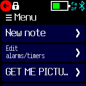
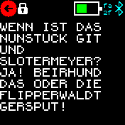
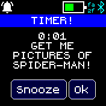

# WARNING

This app uses the [Scheduler library](https://banglejs.com/apps/?id=sched) and requires a [keyboard library](https://banglejs.com/apps/?c=textinput#).

## Usage

* Select "New note" and use the onscreen keyboard to type. 
* Hit back button to exit back to the main menu. New notes are added to the main menu. If you don't type anything and you hit the back button, no new note will be saved.
* Selecting a note from the main menu will allow you to edit, delete, or change the position of the note (1 being the top of the list).
* By selecting "set as alarm" or "set as timer", you can also use this note as a custom message for alerts from alarms and timers. Once you hit save, the alarm or timer is set.
* Any alarms or timers you set will appear under "edit alarms/timers." If the alarm/timer is set to a note, the note will appear on the top of the menu. If an alarm/timer is set without a custom message, it will simply say Alarm or Timer on the top of the menu.
* On the alarm/timer alert, only the first 30 characters of the note will appear - any more and you run the risk of pushing the sleep/ok buttons off-screen.
* Notes can be shown in a clock info area so you can leave messages for yourself. Swipe the clock info area left/right to reach the Noteify category, then swipe up/down to switch between notes.

## Images

## Web interface
You can also add, edit or delete notes in the web interface, accessible with the download button.
