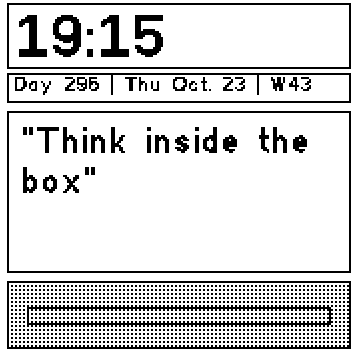

# Oblique Strategies Clock

Inspired by Brian Eno and Peter Schmidt’s
[Oblique Strategies](https://en.wikipedia.org/wiki/Oblique_Strategies).

Oblique Strategies are short prompts created by Brian Eno and Peter Schmidt.  
They can be used to overcome creative blocks or to approach challenges from a different perspective — in art, work, or everyday decision-making.

## Features
- Time display rounded up to the next 5 minutes  
- Displays a new Oblique Strategy every 5 minutes or when tapped  
- Information line: `Day N | Wed Oct. 22 | W43`  
- Motion indicator bar
