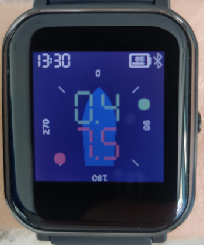

# OpenWind

Receive and display data from a wireless [OpenWind](https://www.openwind.de/) sailing wind instrument on the Bangle.

## Usage

Upon startup, the app will attempt to automatically connect to the wind instrument. This typically only takes a few seconds.

## Features

The app displays the apparent wind direction (via a green dot) and speed (green numbers, in knots) relative to the mounting direction of the wind vane.
If "True wind" is enabled in settings and a GPS fix is available, the true wind speed and direction (relative to the mounting direction of the vane) is
additionally displayed in red.  In this mode, the speed over ground in knots is also shown at the bottom left of the screen.

## Controls

There are no controls in the main app, but there are two settings in the settings app that can be changed:

 * True wind: enables or disables true wind calculations; enabling this will turn on GPS inside the app
 * Mounting angle: mounting relative to the boat of the wind instrument (in degrees)

