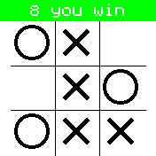
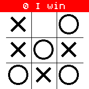
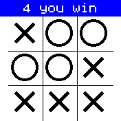

# Oxofocus

A Naughts and Crosses game that learns as it goes

To start with the computer will play random moves and slowly increase
its skill based on a set of logic rules.  During your first few games
the playing logic will apply a new logic rule after each time you
win.  Once you reach eight wins the banner area will turn green
indicating that the computer is now playing at maximum strength.
However it is not as easy as you think and if you make a mistake and
loose a game your score goes back to zero.  The more you play against
a weaker algorithm the more likely you are to loose concentration.

Have you got the focus and concentration to get to maximum playing
strength.  Do you know all the winning moves to out fox the algorithm
?

Written by: [Hugh Barney](https://github.com/hughbarney) For support
and discussion please post in the [Bangle JS
Forum](http://forum.espruino.com/microcosms/1424/)

Credit to `MissionMake` for
[tictactoe](https://banglejs.com/apps/?id=tictactoe) where I have
borrowed the grid drawing code
