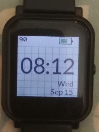
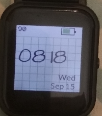
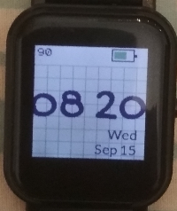
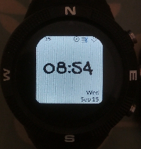
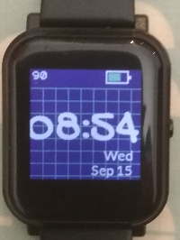
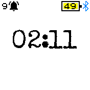

# Pastel Clock - a configurable clock with custom fonts and background

* Designed specifically for Bangle 1 and Bangle 2
* A choice of 7 different custom fonts
* Supports the Light and Dark themes
* Has a settings menu, change font, enable/disable the grid
* On Bangle 1 use BTN1,BTN3 to cycle through the info display (Date, ID, Batt %, Ram % etc)
* On Bangle 2 touch the top right/top left to cycle through the info display (Date, ID, Batt %, Ram % etc)

I came up with the name Pastel due to the shade of the grid background.

